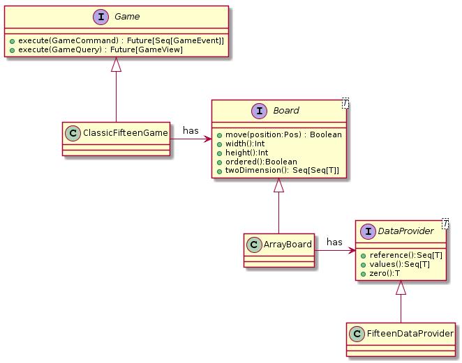

# Fifteen Puzzle Game

## Prerequisite
- scala 2.12

## Project Structure
There are three modules in the project:

 Module     |  Description                                     
------------|-------------------------------------------------
 core       |  Game logic and implementation of game mechanics 
 game-cli   |  Command-Line puzzle implementation 
 game-fx    |  JavaFx puzzle implementation 

## Design


Class      |   Description
-----------|--------------------
Game       | Interface designed in CQRS style with none-blocking API. This allows us to extend game functionally by just add command and queries. None-blocking interfaces will help us develop UI games where we have to have more than one thread or event a client-server implementation. On the other hand game interface covers all the game logic like: start of the game, game statistics, game ending process
Board      | Interface that is responsible for game mechanics, basically providing movements logic and order logic.
DataProvider | Interface that must provide data for the game. In our current example we have a classical implementation of the fifteen puzzle game, but we could also have word puzzle or image puzzle or whatever puzzle game. 

## How to Run
- Compile
```bash
./gradlew clean build
```
- Run 
```bash
java -jar game-fx/build/libs/game-fx-1.0-SNAPSHOT.jar 
```
## Import in idea
- check that gradle pluging installed
- import project by selecting a `build.gradle` file
- wait for import